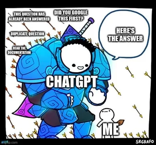

+++
date = '2025-12-27'
draft = false
title = 'On Asking Questions'
tags = ["AI usage", "ios"]
+++

I've seen a bunch of memes saying that ChatGPT is a non-toxic version of StackOverflow (later: SO). 
This is the most typical one:

Image source: <a href="https://www.reddit.com/r/ProgrammerHumor/comments/10aq25y/stackoverflow_and_chatgpt_be_like/">Reddit r/ProgrammerHumor post</a>

### The caveats of outsourcing the context creation to an LLM

I disagree with this idea in general. While ChatGPT won't tell you any of the following:
1. your question lacks context
2. your question isn't scoped well, thus lacks precision
3. you have an implicit assumption which is wrong 

This [How do I ask a good question?](https://stackoverflow.com/help/how-to-ask) guide is definitely worth reading, even if you - like me - switched to ChatGPT as your problem-solving companion. I highly recommend this How to Ask guide - nothing feels better than wrapping up the question context to ask in a Slack support channel, predicting what they could ask as a first follow-up question, and then realising my question contains the answer already. 
Do your homework.

### What may happen if you provide all possible context

My favorite SO question is [this one](https://stackoverflow.com/questions/53225002/is-there-a-way-to-read-data-from-cgimage-without-internal-caching). 
I provided the code, the screenshots, the options I tried. 
I have followed up on the answers and suggestions. While I still feel like an impostor about the CoreGraphics internals, [this answer](https://stackoverflow.com/a/53699004/2567725) still terrifies me in a way that it's kind of closed knowledge you'd never find without asking. 
I remember how positively surprised my manager was about this solution, how I slowly became a go-to person for tasks like this one, and how this env var thing stopped working again a year later. :)

### Vibe-rootcausing

Sometimes dumping all the context in a readable form may take a few hours. Thus it makes sense to speed up this process with an AI coding agent. The initial prompt should still be clear - a high-level description of the problem you're trying to solve. The AI agent then will go and find the context, sometimes a few alternative ways to proceed, and you'll choose the preferred direction. Given the agent will take a non-zero time to gather that context, you should still be able to save time by reducing the solution space, applying your system constraints etc. 

### (An unsuccessful) example of a clear context loop

Recently I've been vibecoding a pet project proof-of-concept, and for some reason chose the SwiftUI navigation which I don't have a clue about. It affected the layout - the screen was shown as a square (some "card layout"?). 

I didn't want to understand the details, I just wanted to proceed with the POC as soon as possible, having a conventional iOS layout. 
Given the project was `xcodegen`-based and that probably contributed to the high-level navigation setup, I finally just gave up and quickly generated the `UIKit`/`AppDelegate`-based navigation, which worked like a charm. 

A fun fact though is that before I gave up, I prompted Cursor Codex with no-brainers like "it's still wrong", "it didn't help" etc. This didn't feel good, so I vibe-coded a script which made the changes, ran a project, took a screenshot, tried to analyse it etc. This also required maintenance but felt like the right way to proceed. If I were persistent enough, this would ultimately lead to the AGI which develops a POC on its own. :D 

### Conclusions

While I believe the question-asking skills from StackOverflow transfer well to ChatGPT and other AI agents in terms of context management, that's not enough. And it's important to find the missing parts.