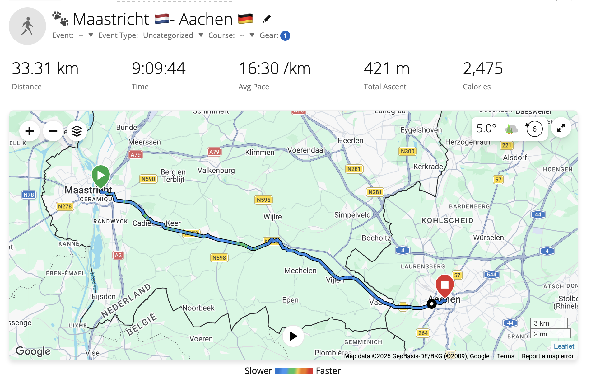
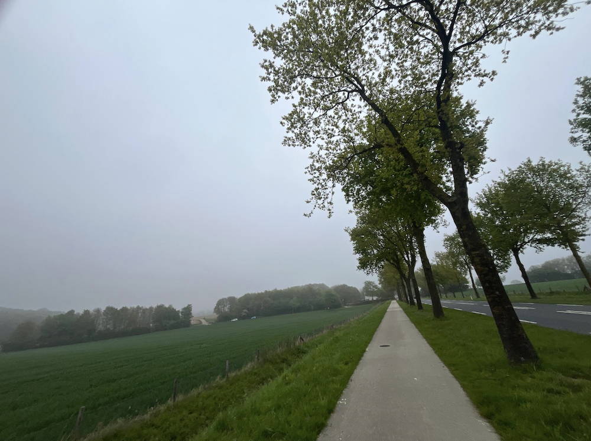
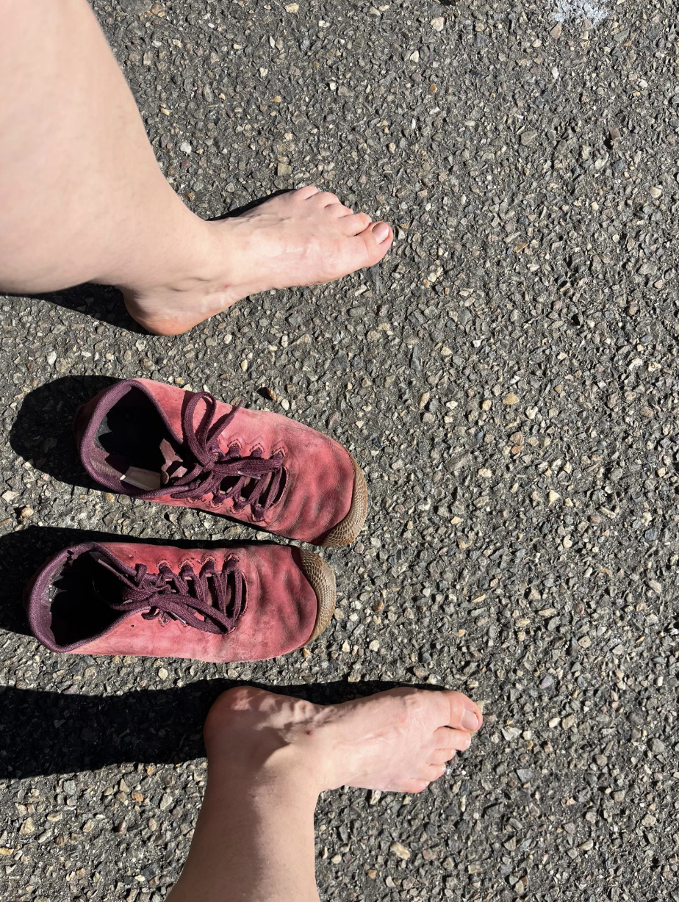

+++
date = '2026-09-19'
draft = false
title = 'The Long Walk'
tags = ["fiction-books", "travel"]
+++

I recently finished a few books by Stephen King, one of them being "The Long Walk". While I didn't know about this book before reading it, the plot resonates with my idea of a good trip 😈

Many of the King's books have been adapted into movies, so I checked the [official trailer](https://www.youtube.com/watch?v=vAtUHeMQ1F8) for this one, and liked it - it reflects the scenery of 19XX-s (*seventies? eighties? you name it*) in the US, Garraty's appearance matches the one I imagined etc.

Now about my longest walk. There was a 22km walk in the Carpathian mountains in Ukraine, and while being the most beautiful one, that's not the longest one. 
As for the Netherlands, there's no mountains, but there is a great coverage of bike lanes everywhere, and a lot of nice hiking routes in Limburg. And I also find the idea of crossing a cross-country border on foot quite funny, and it's easy to achieve that in Limburg. 

So at the end of April 2026, on the Koningsdag public holiday, I had a relatively long walk from Maastricht to Aachen. First there was a 3h train from Amsterdam to Maastricht, then it was 9h walk to Aachen through inter-city bike lanes, farmland fields, cozy towns like Gulp and Vaals. It was about 35km, depending how to count. We had tickets for the overnight FlixBus to Munich, and while that's out of scope for the walk story, I had slight concerns that I'll get exhausted at some random point and will miss the bus. Everything turned out to be fine though, and we had a bit more than 3 hours until the bus upon arriving in Aachen.

But why do I even compare that spring walk with the bestselling thriller book? 😅

1. Well, 35km is tough by definition for an office worker
2. Like with running, all kinds of unexpected body reactions (heart/ankles/stomach/mind) *may (or may not)* appear after some distance threshold, and you don't know that threshold in advance, at least if you're doing a given distance for the first time
3. The King's Walkers had a 4 mph (or 6.4 km/h) speed limit. That sounds crazy to me. I could do that, but maybe only for 1-2 hours long, not for 90 hours indeed 😬. My garmin watch shows like 3.64 km/h, and IIRC I put the watch on a pause when having some coffee in Gulp's cafe.
4. Regarding pt 2: I was in good shape, pumped for the walk, had a very light backpack, *and* was wearing minimalist shoes. Not going to describe that barefoot fetish here, as it's a broad topic, but the main point is that the foot muscles become stronger in the long term, and there's zero cushioning / shock absorption. ~~Like they say, what doesn't kill you makes you stronger.~~
5. Just as all of the Walkers gave up at some point or another, my feet started to give up at about 27th km mark. Each step resulted in a sharp stabbing pain, no matter which part of the foot I tried to involve. The sitting breaks didn't help. My feet were cooked, and the pain didn't stop until the next day. All that kept me going was the unwillingness to cheat by taking public transport, and the image of a bratwurst with a non-alcoholic weissbier *somewhere at the end*. Oh, and the bus departure deadline.
6. Was that suffering (in particular, Garraty's) pointless? I think yes. But it can also be fun due to endorphins-releasing-during-a-physical-challenge, if it's not a thriller and one's life doesn't depend on it.

I made 50k+ steps that day for the first time.

Would I do that again? Yeah, there's a walk from Maastricht to Liège in the backlog, but it has to be prioritized. 😄